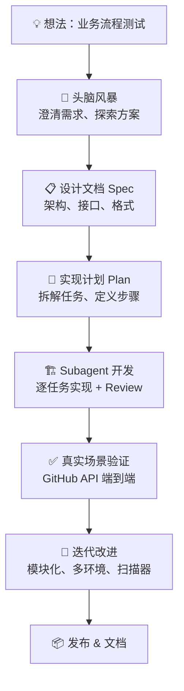
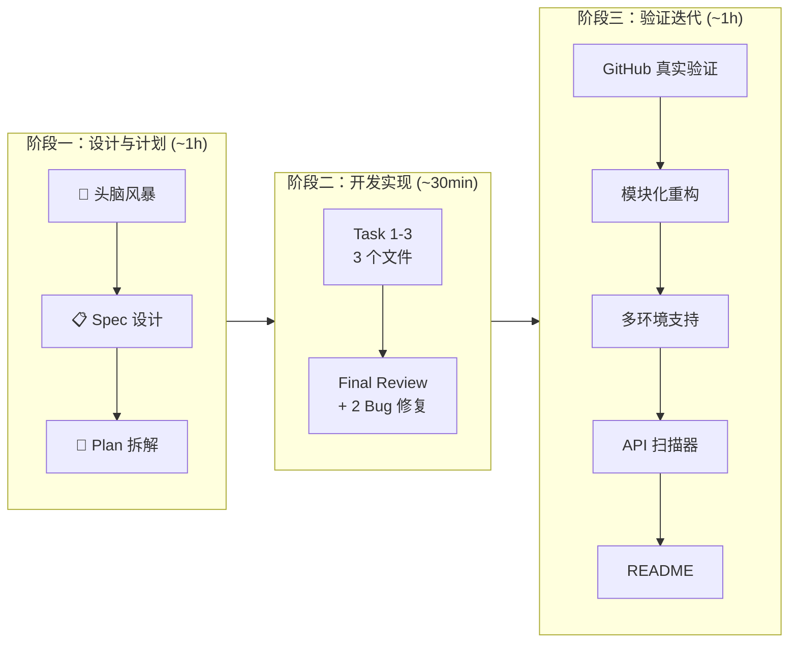
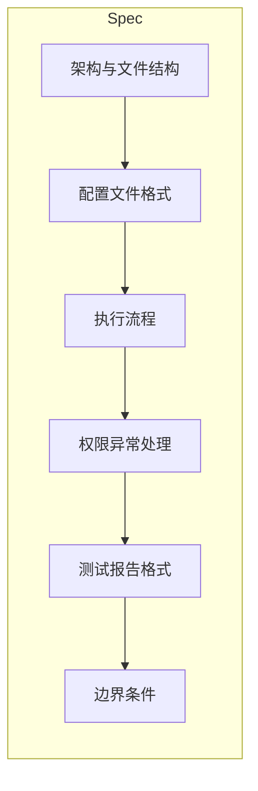
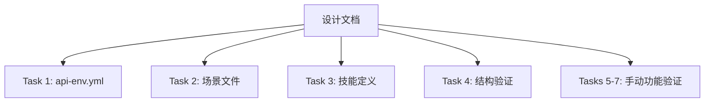
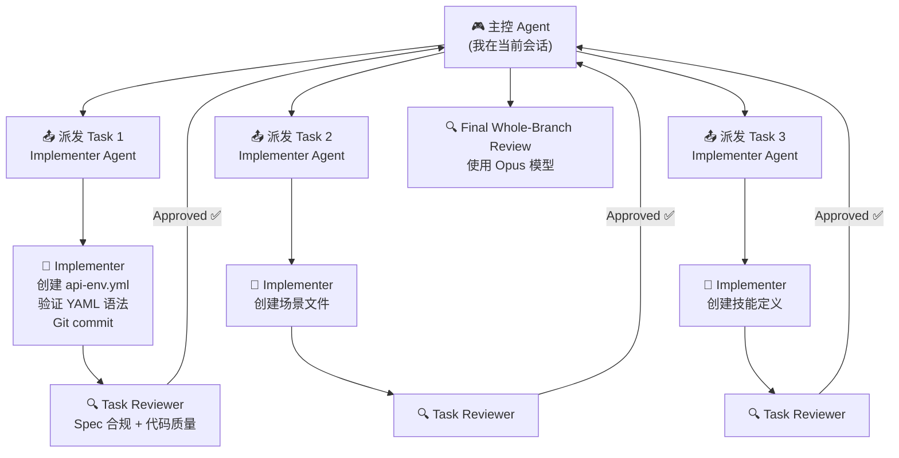
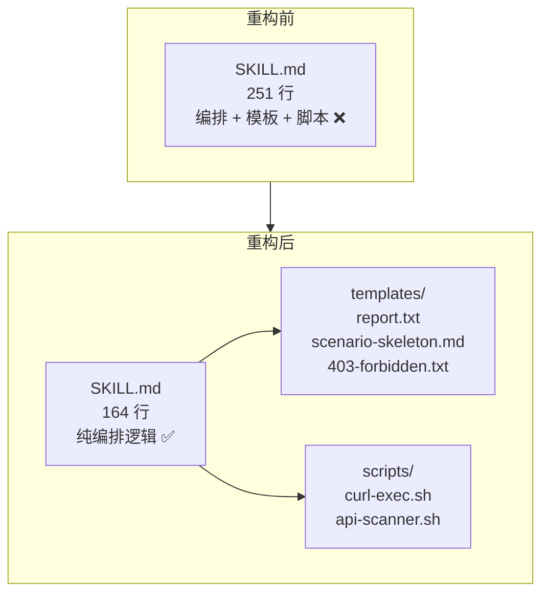
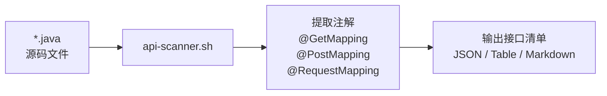
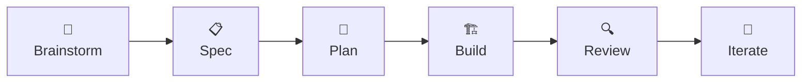

# biz-test 技能诞生记：从想法到落地的完整历程

> 一个 Claude Code 自定义技能的完整开发过程——如何用 AI 辅助，把一个"业务流程测试"的想法变成可用的工具。

---

## 目录

1. [背景与动机](#1-背景与动机)
2. [整体流程概览](#2-整体流程概览)
3. [阶段一：头脑风暴](#3-阶段一头脑风暴)
4. [阶段二：设计文档](#4-阶段二设计文档)
5. [阶段三：实现计划](#5-阶段三实现计划)
6. [阶段四：Subagent-Driven 开发](#6-阶段四subagent-driven-开发)
7. [阶段五：真实场景验证](#7-阶段五真实场景验证)
8. [阶段六：模块化重构](#8-阶段六模块化重构)
9. [阶段七：多环境支持](#9-阶段七多环境支持)
10. [阶段八：API 扫描工具](#10-阶段八api-扫描工具)
11. [最终产物](#11-最终产物)
12. [关键经验](#12-关键经验)

---

## 1. 背景与动机

在日常开发中，我们经常需要验证一个业务流程是否正常——比如"用户注册 → 登录 → 下单 → 支付"这一系列接口是否都能调通。通常的做法是手动用 Postman 或 curl 逐个调，但这样有几个问题：

- 每次换环境（DEV/ST/UAT）要改一堆 URL 和 Token
- 步骤之间的数据依赖（如"下单"需要"登录"返回的 Token）靠人工复制粘贴
- 验证结果靠人眼看，没有结构化的断言
- 测过的场景无法沉淀，下次还得从头来

于是有了这个想法：**做一个 Claude Code 技能，用 Markdown 描述调用链路，一键执行、自动断言、自动沉淀。**

---

## 2. 整体流程概览

整个开发过程遵循了一套结构化方法：



**时间线（2026-07-06，总计约 3 小时）：**



---

## 3. 阶段一：头脑风暴

这是最关键的一步——**在写任何代码之前，把需求想清楚**。

### 3.1 澄清需求（一问一答）

Superpowers 的 brainstorming 技能引导我们进行了 8 轮问答，每次只问一个问题，逐步收窄范围：

| 轮次 | 问题 | 用户选择 |
|------|------|----------|
| 1 | 技能形式？Skill / Java 框架 / 混合方案 | **A: 纯 Claude Code 技能** |
| 2 | 触发方式？手动命令 / 配置文件 / 两者结合 | **C: 两者结合** |
| 3 | 接口类型？REST API / Spring Bean / 两者 | **A: 纯 REST API** |
| 4 | 配置管理？场景自包含 / 环境分离 / 每次询问 | **B: 环境与场景分离** |
| 5 | 配置格式？YAML / JSON / Markdown+Given/When/Then | **C: Markdown + Gherkin 风格** |
| 6 | 数据依赖？AI 自动推断 / 显式声明 / AI 自由裁量 | **C: AI 探索 + 通过后固化** |
| 7 | 失败策略？立即停止 / 重试后停止 / 支持跳过 | **A: 失败即停** |
| 8 | 断言方式？精确断言 / 自然语言 / 两者结合 | **C: 精确 + 自然语言** |

### 3.2 银行场景验证格式

用"反洗钱可疑交易报送"这个真实场景验证了 Markdown 格式是否合理。8 个步骤覆盖了从登录、案例审核、报文生成到监管报送、归档的完整链路，发现了三个需要补充的点：

- 前置数据依赖需要 `## 前置条件` 区块
- 重复认证头需要 `## 公共请求头` 区块
- T+1 异步回执需要"容许值断言"（`$.status` 属于 `["ACCEPTED","PENDING"]`）

### 3.3 方案选择

对比了三种实现方案：

| 方案 | 描述 | 选择 |
|------|------|------|
| A: 纯技能 + 两层配置 | Claude Code 技能 + Markdown 场景 + YAML 环境 | ✅ **选中** |
| B: 技能编排 + Java 执行器 | AI 理解场景，Java 执行调用 | ❌ 需要维护 Java 组件 |
| C: 纯 AI Agent 驱动 | 每步由子 Agent 执行 | ❌ 稳定性低、Token 消耗大 |

**选择 A 的理由：** 零 Java 依赖、跨项目复制即用、场景文件可读可版本管理。

---

## 4. 阶段二：设计文档

头脑风暴确认方案后，按 6 个维度编写结构化设计文档：



每个维度的设计都已经在 `docs/superpowers/specs/2026-07-06-biz-flow-test-design.md` 中明确写定。关键决策：

- 文件结构：`.claude/skills/biz-flow-test.md` + `api-env.yml` + `test-scenarios/*.md`
- 变量引用语法：`{{步骤N.字段路径}}` 和 `{{env.VAR}}`
- 固化机制：首次 AI 推断 → 全部通过后写回精确规则 → 后续直接复用

Spec 写完后提交 Git，作为后续所有开发的唯一真相来源。

---

## 5. 阶段三：实现计划

设计文档 → 拆解为可执行的任务。



每个 Task 都定义了：
- **创建/修改哪些文件**（精确路径）
- **接口契约**（生产什么、消费什么）
- **分步执行指令**（含完整代码和期望输出）

这就是 writing-plans 技能的核心理念：**每个步骤都是可无脑执行的，不需要额外判断。**

---

## 6. 阶段四：Subagent-Driven 开发

这是最体现效率的部分——用 **Subagent-Driven Development** 模式执行计划：



### 6.1 关键发现：Final Review 找到了 2 个 Critical Bug

| Bug | 问题 | 影响 |
|-----|------|------|
| **命令名不匹配** | frontmatter `name: biz-flow-test` 但文档全是 `/biz-test` | 用户输入 `/biz-test` 不识别 |
| **--max-time 单位错误** | curl 超时传了毫秒值 30000，但 curl 期望秒 | 30 秒超时变成 8.3 小时 |

还有 3 个 Important 问题：缺失 POSIX 尾换行、`basic`/`none` 认证类型未处理、`refreshToken` 变量来源不明确。

**启示：** 代码审查不能省略，即使是 AI 生成的代码。Final review 使用了更强大的模型（Opus），发现了 implementer 遗漏的问题。

### 6.2 技能文件结构修正

第一次部署时发现技能不生效。排查后发现：Claude Code 要求技能文件放在**子目录**中，文件必须命名为 `SKILL.md`：

```
❌ .claude/skills/biz-flow-test.md
✅ .claude/skills/biz-test/SKILL.md
```

这是文档和实际行为之间的差异，通过阅读 GitHub Issues 和实验验证解决。

---

## 7. 阶段五：真实场景验证

理论设计再好，也要用真实 API 跑一遍。选择了 **GitHub REST API** 作为测试目标：

### 7.1 场景编写

```markdown
# 场景：查询 GitHub 仓库列表
## 步骤 1：查询用户仓库列表
- 方法: GET
- 路径: /users/ZhiqiangQIAO/repos
- 预期: 状态码 200，包含 integration_test 仓库
```

### 7.2 遇到的第一个真实问题：403 限频

```
🚫 步骤 1 "查询用户仓库列表" 返回 403 Forbidden
API rate limit exceeded for 203.175.14.59.
```

**这正是技能设计的场景！** 按照权限异常处理流程：


用 `gh auth token` 获取 GitHub Token 后重试，立即通过。

### 7.3 验证固化机制

首次执行通过后，技能自动在场景文件中补充了显式提取规则：

```markdown
- **提取**:
  - `$.[?(@.name=='integration_test')].full_name` → repoFullName
  - `$.[?(@.name=='integration_test')].html_url` → repoUrl
```

第二次执行同一场景——**零 AI 推断，直接复用固化规则**，执行更快更稳定。

---

## 8. 阶段六：模块化重构

最初的 SKILL.md 把所有模板和脚本都内联在 Markdown 中（251 行），维护困难。重构为模块化结构：



**好处：**
- 改报告格式只动 `report.txt`，不动核心逻辑
- `curl-exec.sh` 可以脱离 AI 独立测试
- 跨项目复制整个目录即可

---

## 9. 阶段七：多环境支持

原始设计只支持单一环境。用户提出需要 DEV/ST/UAT 三套环境切换。

**改造方案：** 单文件多 section

```yaml
default: dev
environments:
  dev:    { base_url: https://dev-api...,  auth: ... }
  st:     { base_url: https://st-api...,   auth: ... }
  uat:    { base_url: https://uat-api...,  auth: ... }
  github: { base_url: https://api.github.com, auth: ... }
```

**新的命令语法：**

```
/biz-test order-flow --env st     # 指定 ST 环境
/biz-test order-flow              # 使用默认环境 (dev)
/biz-test --env list              # 列出所有可用环境
```

改造涉及 2 个文件：`api-env.yml`（配置）和 `SKILL.md`（步骤 0 环境选择逻辑），30 分钟内完成。

---

## 10. 阶段八：API 扫描工具

用户提出的最后一个需求：**写 case 时不知道项目有哪些接口可调用。**

解决方案：`scripts/api-scanner.sh`



**关键挑战：** macOS 的 BSD grep 不支持 `-P`（Perl regex）和 `(?:...)` 非捕获组。用 `sed -E` 替代 `grep -oP` 解决兼容性问题。

使用方式：

```
/biz-test --scan
```

输出接口清单后，写 case 时就知道"先调 `/api/auth/login`，再调 `/api/order/create`"。

---

## 11. 最终产物

```
integration_test/
├── .claude/skills/biz-test/
│   ├── SKILL.md                      # 技能编排逻辑 (164 行)
│   ├── README.md                     # 用户文档
│   ├── templates/
│   │   ├── report.txt                # 报告模板
│   │   ├── scenario-skeleton.md      # 场景骨架
│   │   └── 403-forbidden.txt         # 403 错误模板
│   └── scripts/
│       ├── curl-exec.sh              # HTTP 请求执行
│       └── api-scanner.sh            # API 接口扫描
├── api-env.yml                       # 多环境配置 (DEV/ST/UAT)
├── test-scenarios/
│   ├── aml-suspicious-report.md      # 银行反洗钱报送场景
│   └── github-check-repos.md         # GitHub 仓库查询场景
└── docs/superpowers/
    ├── specs/...-design.md           # 设计文档
    ├── plans/...-plan.md             # 实现计划
    └── biz-test-journey.md           # 本文档
```

### 已沉淀的 Git 提交历史

```
28e6c31 docs: add README for biz-test skill
95cec4d feat: add api-scanner.sh to discover project API endpoints
1ef0174 feat: add multi-environment support (DEV/ST/UAT)
74a3024 refactor: modularize biz-test skill with templates and scripts
03ab710 feat: add GitHub repo check scenario and verify biz-test skill end-to-end
5e67bfc fix: deduplicate token field in api-env.yml
fcf58fd fix: move skill to correct directory structure (.claude/skills/biz-test/SKILL.md)
a5c5eed fix: apply final review fixes
430407c feat: add biz-flow-test skill for business flow API testing
5298d2b feat: add AML suspicious transaction report example scenario
336bd85 feat: add api-env.yml environment config template
ad14f7e docs: add biz-flow-test implementation plan
129f9ae docs: add biz-flow-test skill design spec
```

---

## 12. 关键经验

### 12.1 结构化流程的价值



| 阶段 | 投入 | 价值 |
|------|------|------|
| Brainstorm | 8 轮问答，~30min | 避免方向性错误，8 个关键决策一次确定 |
| Spec | 结构化文档 | 所有后续工作的唯一真相来源 |
| Plan | 精细任务拆解 | Subagent 可无脑执行 |
| Subagent Build | 3 个独立 Agent | 孤立上下文，专注单一任务 |
| Review | 4 轮审查 | 发现 2 个 Critical + 3 个 Important |
| 真实验证 | GitHub API 测试 | 验证了 403 处理、固化机制、模板渲染 |

### 12.2 AI 辅助开发的心得

1. **先设计再动手。** Brainstorming 阶段看似慢，但省掉了后面的大量返工。8 个关键决策在写代码前就定好了。

2. **Review 不能省。** 即使是 AI 生成的代码，Final Review 也发现了 2 个会导致功能故障的 Critical Bug。用更强的模型做 Review 是值得的。

3. **用真实场景验证。** GitHub API 的 403 限频恰好验证了权限异常处理流程，这是 mock 数据永远测不出来的。

4. **技能文件结构有坑。** Claude Code 要求 `.claude/skills/<name>/SKILL.md` 而非 `.claude/skills/<name>.md`，文档没写清楚，需要实验验证。

5. **跨平台兼容性。** `api-scanner.sh` 在 macOS 的 BSD grep 上失败——`grep -oP` 和 `(?:...)` 语法不兼容。用 `sed -E` 重写解决。

6. **模块化是渐进式的。** 一开始把模板和脚本内联是合理的（快速验证想法），等结构稳定后再提取到独立文件。
